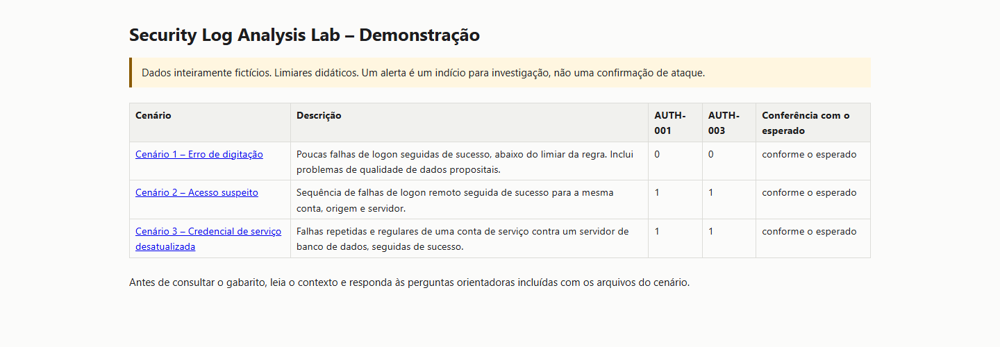
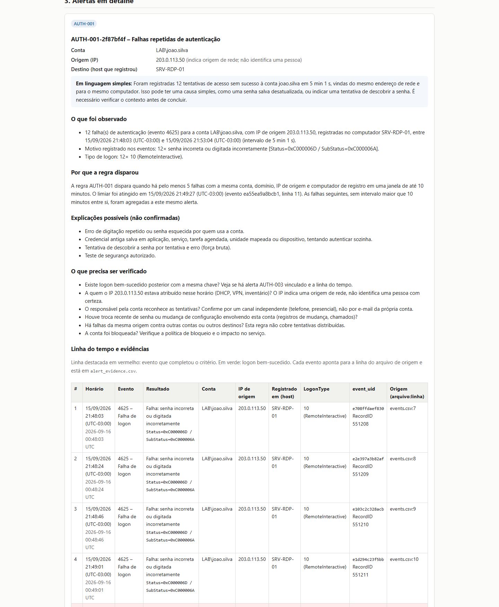

# Security Log Analysis Lab



Laboratório didático de **SOC / Blue Team** para praticar investigação de eventos de autenticação do Windows. O foco é entender o que os registros mostram, por que uma regra alerta e quais perguntas ainda precisam ser respondidas.

> Dados inteiramente fictícios. Um alerta é um indício para investigação, não uma confirmação de ataque. Os limiares são exemplos didáticos, não valores recomendados para ambientes reais.

## O que o projeto faz

```text
CSV documentado → validação e normalização → AUTH-001/AUTH-003 → evidências → relatório HTML local
```

O participante pratica leitura dos eventos `4624` (logon bem-sucedido) e `4625` (falha), correlação temporal, avaliação de falsos positivos e comunicação de conclusões. O laboratório não é um SIEM: não coleta eventos continuamente, não bloqueia acessos e não usa banco de dados.

## Evidência visual

O relatório abaixo foi gerado pelo cenário fictício **Acesso suspeito**. Ele mostra os contadores de qualidade, os alertas AUTH-001/AUTH-003, a explicação, as hipóteses e a trilha de eventos de origem.



## Início rápido (Windows / PowerShell)

Requisitos: Python 3.10 ou superior e Git. Não precisa de privilégios administrativos.

```powershell
git clone https://github.com/LeandroGoulart/security-log-analysis-lab.git
cd security-log-analysis-lab
py -m venv .venv
.\.venv\Scripts\python.exe -m pip install -e ".[dev]"
.\.venv\Scripts\authlab.exe demo --open
```

Se `py` não estiver disponível, use `python -m venv .venv`. `authlab.exe` abre o índice HTML no navegador; as saídas são criadas em `output\demo\`.

Verificado no Windows com Python 3.13: instalação editável, **87 testes aprovados**, demo estrita dos três cenários e instalação/executação de wheel em ambiente temporário fora do repositório.

## Cenários demonstrados

| Cenário | O que ensina | Resultado padrão |
|---|---|---|
| [Erro de digitação](src/authlab/resources/scenarios/01-erro-digitacao/README.md) | Poucas falhas abaixo do limiar; dados incompletos não significam ausência de atividade | Sem alertas |
| [Acesso suspeito](src/authlab/resources/scenarios/02-acesso-suspeito/README.md) | Falhas repetidas seguidas de sucesso; investigar origem e contexto | AUTH-001 + AUTH-003 |
| [Credencial de serviço desatualizada](src/authlab/resources/scenarios/03-credencial-servico/README.md) | Uma regra pode estar correta e ainda alertar sobre uma causa operacional legítima | AUTH-001 + AUTH-003 |

Todos incluem CSV, contexto fictício, perguntas e gabarito separado. Veja o [guia de estudo dos cenários](src/authlab/resources/scenarios/README.md).

## Regras

As duas regras usam a mesma chave de correlação: **domínio + conta + IP válido de origem + host que registrou o evento**. Valores padrão configuráveis estão em [rules.yaml](src/authlab/resources/config/rules.yaml) e são apenas didáticos.

| Regra | Resumo | Limite conhecido |
|---|---|---|
| **AUTH-001** | Alerta ao atingir 5 falhas `4625` em até 10 minutos; um alerta por episódio | Não correlaciona origens, contas ou hosts diferentes; ataques lentos podem passar |
| **AUTH-003** | Relaciona um `4624` posterior à sequência AUTH-001, em até 30 minutos | Exige a mesma chave completa; horário igual não estabelece ordem |

Veja a [especificação das regras](docs/regras.md) e a [documentação do CSV](docs/formato-csv.md). O formato de entrada é próprio do projeto: não é CSV genérico do Event Viewer e não há suporte a EVTX.

## Artefatos gerados

Cada execução cria relatório HTML autocontido e arquivos CSV/JSON com eventos normalizados, alertas, relação alerta-evidência, rejeições, duplicatas e resumo. As rejeições guardam referência e motivo, sem copiar valores brutos inválidos.

Para analisar outro CSV já no formato documentado:

```powershell
.\.venv\Scripts\python.exe -m authlab analyze --input data\samples\auth_events.csv --out output\exploratorio
```

Para explorar um alerta, use o [roteiro de investigação](docs/investigacao.md) e preencha a [ficha](docs/ficha-investigacao.md). O [exercício de calibração](docs/calibracao.md) mostra como alterar o limiar muda os resultados fictícios.

## Testes

```powershell
.\.venv\Scripts\python.exe -m pytest
```

Os testes cobrem limites e ordenação temporal, campos/chaves ausentes, deduplicação, rejeições, rastreabilidade, prevenção de alertas repetidos, segurança do HTML/CSV e execução dos três cenários. Instalação e dependências de desenvolvimento: `python -m pip install -e ".[dev]"`.

## Privacidade dos dados

- Os samples e cenários versionados são fictícios. O `.gitignore` exclui pastas de entrada real, relatórios/saídas, EVTX, logs, credenciais e configurações `.vscode/`.
- Eventos válidos, alertas e relatórios podem conter contas, hosts e IPs. As saídas padrão ficam em `output/`, que é ignorado pelo Git; não publique relatórios, dashboards ou capturas feitos com dados reais.
- Antes de publicar, confira `git status`. O ignore reduz acidentes, mas não anonimiza arquivos nem impede `git add -f`.

## Limitações e próximos passos

O projeto processa arquivos em lote, não confirma comprometimento e não detecta tentativas distribuídas entre várias origens/contas/hosts. Não importa logs reais do Windows nem EVTX; não implementa resposta automática.

Roadmap: AUTH-002 (padrão compatível com password spraying), AUTH-004 (fora de horário), importação validada de dados Windows, Sigma, Power BI e comparação com um SIEM.

Para começar pelo básico, leia o [guia para iniciantes](docs/README.md). O andamento por etapas fica no [checklist](docs/CHECKLIST.md) e as [decisões de projeto](docs/decisoes.md) explicam as premissas.
